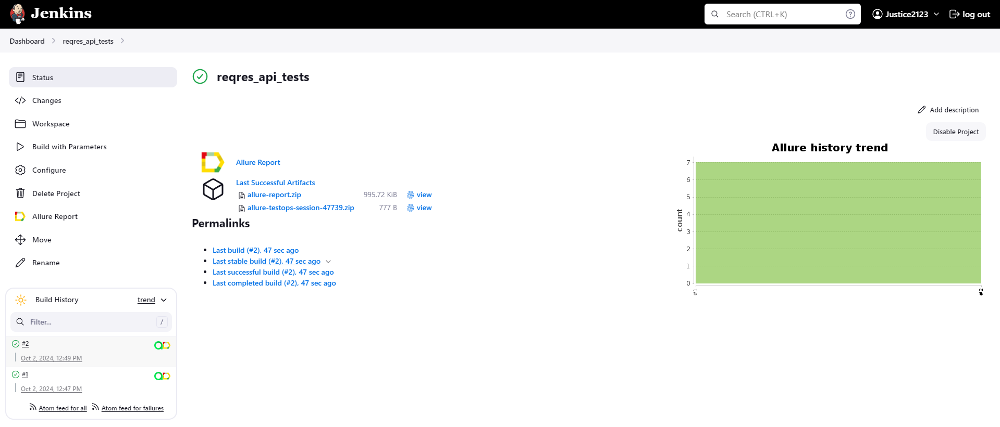
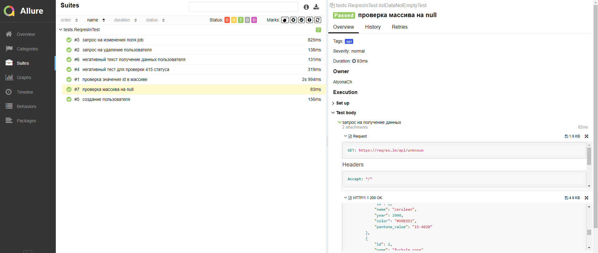
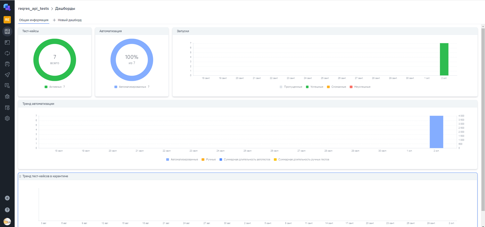
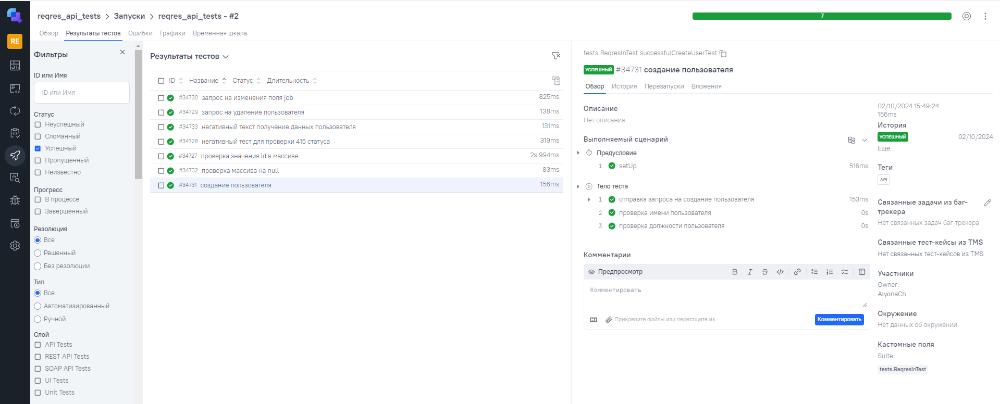
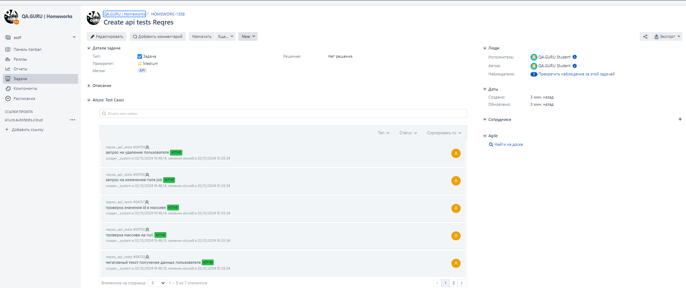
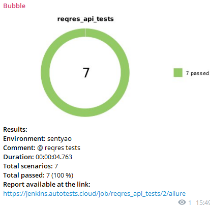

# Проект по автоматизации тестирования API сервиса Reqres

## :man_student:: Содержание:

- <a href="#tools"> Технологии и инструменты</a>
- <a href="#console"> Запуск тестов из терминала</a>
- <a href="#jenkins"> Сборка в Jenkins</a>
- <a href="#allureReport"> Allure отчет</a>
- <a href="#allure"> Интеграция с Allure TestOps</a>
- <a href="#jira"> Интеграция с Jira</a>  
- <a href="#tg"> Уведомления в Telegram с использованием бота</a>
---

## 🔨 Технологии и инструменты:

Автотесты написаны на языке `Java` с использованием `JUnit 5`, `Selenide`, `Rest-Assured`. Сборщик проекта - `Gradle`. Для удаленного запуска реализована задача в `Jenkins` с формированием `Allure-отчета` и
отправкой результатов в `Telegram канал` при помощи бота. Так же осуществлена интеграция с `Allure TestOps` и `Jira`.

---

### Локальный запуск тестов из терминала
`gradle clean test`

---

## </a> Сборка в <a target="_blank" href="https://jenkins.autotests.cloud/job/reqres_api_tests/"> Jenkins </a>
Для запуска сборки необходимо перейти в раздел <code>Собрать с параметрами</code> затем нажать кнопку <code>Собрать</code>.

После выполнения сборки, в блоке История сборок напротив номера сборки появятся значки Allure Report и Allure TestOps, при клике на которые откроется страница с сформированным html-отчетом и тестовой документацией соответственно.

---

##  [Allure](https://jenkins.autotests.cloud/job/reqres_api_tests/2/allure/) отчет

### 🖨️ Главная страница отчета

### 📄 Тест-кейсы

---

##  </a>Интеграция с <a target="_blank" href="https://allure.autotests.cloud/project/4467/dashboards">Allure TestOps</a>
На *Dashboard* в <code>Allure TestOps</code> видна статистика количества тестов. Новые тесты, а так же результаты прогона приходят по интеграции при каждом запуске сборки.
## 🖨️ Основная страница отчёта

  
  

  

## :pinching_hand:: Пример тест-кейса

---

##  Интеграция с [Jira](https://jira.autotests.cloud/browse/HOMEWORK-1358)

Реализована интеграция <code>Allure TestOps</code> с <code>Jira</code>, в тикете отображается, какие тест-кейсы были написаны в рамках задачи и результат их прогона.
### Задача в Jira

#### Содержание задачи

- :heavy_check_mark: Цель
- :heavy_check_mark: Задачи для выполнения
- :heavy_check_mark: Тест-кейсы из Allure TestOps
- :heavy_check_mark: Результат прогона тестов в Allure TestOps

---

##  Уведомления в Telegram чат с ботом

После завершения сборки специальный бот, созданный в <code>Telegram</code>, автоматически обрабатывает и отправляет сообщение с отчетом о прогоне тестов.

### Уведомление из переписки с чат ботом

